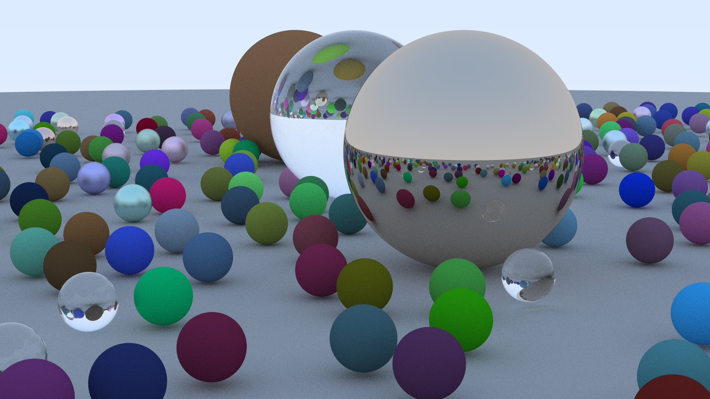

# Ray Tracer

Simple implementation of Ray Tracing in One Weekend in Rust

From:

[Ray Tracing in One Weekend](https://raytracing.github.io/books/RayTracingInOneWeekend.html)

[Ray Tracing: The Next Week](https://raytracing.github.io/books/RayTracingTheNextWeek.html)
